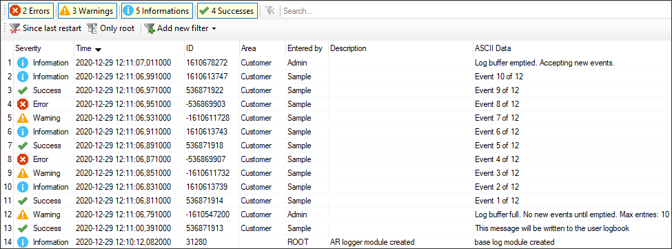

# LibUserLog

A sample Automation Studio project demonstrating the UserLog library. This repository also serves the development of the UserLog library with [released updates](https://github.com/tmatijevich/LibUserLog/releases).

- Clone the project: `git clone git@github.com:tmatijevich/LibUserLog.git`
	- Alternative: `ssh://git@ssh.github.com:443/tmatijevich/LibUserLog.git`
- [Download UserLog library](https://github.com/tmatijevich/LibUserLog/releases/download/0.1.3/UserLog_V0.01.3.zip)
- [Download LibUserLog sample project](https://github.com/tmatijevich/LibUserLog/releases/download/0.1.3/LibUserLog.zip)

## UserLog

Log messages are written to their logbook asynchronously and taken multiple program scans to complete. The UserLog library buffers all log messages added by the `LogEvent` function to be automatically written to the user logbook.

```
// Initalize inputs to the LogEvent function
Severity    := USER_LOG_SEVERITY_SUCCESS;
Code        := 1001;
Message     := 'This message will be written to the user logbook';

// Write a single event to the user logbook
IF CmdWrite THEN
	CmdWrite := FALSE;
	LogEvent(Severity, Code, Message);
END_IF
```

An instance of the `CyclicLogBuffer` function block must be called to perform the writes to the user logbook.

```
// Log buffered event entries
CyclicLogBuffer_0();
```

Use `GetBufferInfo` for current status information on the buffer (optional).

Perform an offline installation to ARsim when first opening the LibUserLog sample project.
1. Once connected to ARsim `127.0.0.1`, open the logger.
2. Select visibility of the user logbook.
3. Open the watch window for the Sample task.
4. Set CmdWrite to TRUE.
5. Set CmdBurst to TRUE.
	- The burst test demonstrates how the log buffer handles multiple log messages in a single program scan.



**Note:** Adjust `USER_LOG_BUFFER_SIZE` under `UserLog\Constants.var` to a value suitable for your application. (Default is 10)

## Git
- [Install and setup Git](https://tmatijevich.github.io/gfw-tutorial/)
- [Setup gitignore for your repository](https://gist.github.com/tmatijevich/453436f1e6abc62a3d052d9b03f9db58)

## Automation Studio
Version 4.7.5.60 SP

## Automation Runtime

Component 				| Project 			| Config - Simulation	
------------------------|-------------------|-----------------------
Automation Runtime		| x					| B4.73 
Visual Components		| x 				| n/d 
mapp Motion 			| n/d 				| x 
mapp View 				| n/d 				| x 
mapp Services 			| n/d 				| x 
ACP10 ARNC0				| n/d 				| x 
mapp Control 			| n/d 				| x 
mapp Cockpit 			| n/d 				| x 
Safety Release 			| n/d 				| x 

## Dependencies
- ArEventLog
	- runtime
- AsBrStr
- sys_lib
	- runtime

## Recommendations
- IecFrmtStr
